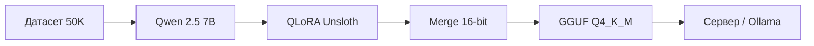

<div align="center">
  
</div>

<p align="center">
  <b>🧠 Терапевтический ИИ-помощник на русском языке</b><br>
  <sub>От собственной 102M модели до fine-tune Qwen 2.5 7B с GGUF Q4_K_M</sub>
</p>

<p align="center">
  <a href="#-о-проекте"></a>
  <a href="#-модели"></a>
  <a href="#-быстрый-старт"></a>
  <a href="#-датасет"></a>
  <a href="#-fine--tune-qwen-25-7b"></a>
</p>

<p align="center">
  
  
  
  
  
  
</p>

---

## 💚 О проекте

**Mental Health AI** — это проект по созданию ИИ-помощника для психологической поддержки на русском языке. Включает две версии модели:

| | **TinyGPT** | **Qwen 2.5 7B (recommended)** |
|---|---|---|
| Параметры | 102M | 7.6B |
| Тип | Обучена с нуля | Fine-tune (LoRA) |
| Квантование | FP32 | Q4_K_M (GGUF) |
| Размер | ~400 MB | ~4.7 GB |
| Качество | Базовая эмпатия | Глубокое понимание |

> ⚠️ **Дисклеймер**: Модель создана в образовательных целях. При серьёзных проблемах обращайтесь к профессиональным психологам.

---

## 🏗 Архитектура

### TinyGPT (102M)
Современный декодер-only трансформер, написанный с нуля на PyTorch:

<table>
  <tr>
    <th>Компонент</th>
    <th>Описание</th>
  </tr>
  <tr>
    <td><b>RoPE</b></td>
    <td>Rotary Position Embeddings — позиционная кодировка из Llama/Mistral</td>
  </tr>
  <tr>
    <td><b>SwiGLU</b></td>
    <td>Gated activation function (PaLM / Llama)</td>
  </tr>
  <tr>
    <td><b>Flash Attention</b></td>
    <td>PyTorch SDPA с аппаратным ускорением на GPU</td>
  </tr>
  <tr>
    <td><b>RMSNorm</b></td>
    <td>Pre-normalisation для стабильного обучения</td>
  </tr>
  <tr>
    <td><b>Weight Tying</b></td>
    <td>Общие веса эмбеддингов и LM головы</td>
  </tr>
</table>

<details>
<summary><b>📊 Характеристики TinyGPT</b></summary>

```
Параметры:  101,710,080
Embedding:  768
Layers:     14
Heads:      12
Head dim:   64
Block size: 192
Словарь:    3,382 BPE токенов
Размер:     ~400 MB (fp32)
```
</details>

### Qwen 2.5 7B (Fine-tune)
Базовая модель — [Qwen/Qwen2.5-7B-Instruct](https://huggingface.co/Qwen/Qwen2.5-7B-Instruct). Fine-tune через QLoRA (Unsloth) с экспортом в GGUF Q4_K_M.

| Компонент | Значение |
|-----------|----------|
| LoRA rank | 16 |
| Target modules | Q,K,V,O, Gate, Up, Down |
| Quant | 4-bit NF4 (train), Q4_K_M (export) |
| VRAM | ~6.5 GB на RTX 3070 |
| Длительность | ~30 мин на 1 эпоху |

---

## 🚀 Быстрый старт

### TinyGPT (102M)

<table>
<tr>
<td>

**Установка**
```bash
git clone https://github.com/Fromix1234/mental-health-app.git
cd mental-health-app
pip install torch tokenizers tqdm
```

</td>
<td>

**Обучение и запуск**
```bash
python train.py --device cuda
python web_interface.py
# http://localhost:8765
```

</td>
</tr>
</table>

### Qwen 2.5 7B (9B pipeline)

<table>
<tr>
<td>

**1. Установка**
```bash
pip install -r requirements_unsloth.txt
```

</td>
<td>

**2. Fine-tune + GGUF**
```bash
python finetune_qwen_lora.py
# → models/unsloth.Q4_K_M.gguf (~4.7 GB)
```

</td>
<td>

**3. Запуск**
```bash
python deploy_gguf.py
# Или через Ollama:
# ollama create mental-health -f Modelfile
```

</td>
</tr>
</table>

---

## 📚 Датасет

<p align="center">
  <b>50 000 диалогов</b> · <b>40+ категорий</b> · <b>Русский язык</b>
</p>

<table>
  <tr>
    <th>Категория</th>
    <th>Примеры</th>
  </tr>
  <tr><td><b>🧘 Тревога</b></td><td>Генерализованная тревога, панические атаки, социальная тревога</td></tr>
  <tr><td><b>🌧 Депрессия</b></td><td>Ангедония, апатия, потеря смысла, суицидальные мысли</td></tr>
  <tr><td><b>💫 ПТСР и травма</b></td><td>Флешбеки, кошмары, избегание</td></tr>
  <tr><td><b>🔄 ОКР</b></td><td>Навязчивые мысли, компульсии, ритуалы</td></tr>
  <tr><td><b>⚡ СДВГ</b></td><td>Проблемы с фокусом, прокрастинация, гиперфиксация</td></tr>
  <tr><td><b>🌊 Биполярное расстройство</b></td><td>Мания, гипомания, депрессивные эпизоды</td></tr>
  <tr><td><b>🍽 РПП</b></td><td>Анорексия, булимия, компульсивное переедание</td></tr>
  <tr><td><b>🍷 Зависимости</b></td><td>Алкоголь, курение, цифровая зависимость</td></tr>
  <tr><td><b>💕 Отношения</b></td><td>Конфликты, расставания, созависимость</td></tr>
  <tr><td><b>🏠 Семья</b></td><td>Сепарация, дисфункциональные семьи</td></tr>
  <tr><td><b>🕊 Горе и утрата</b></td><td>Потеря близкого, траур, чувство вины</td></tr>
  <tr><td><b>⭐ Самооценка</b></td><td>Синдром самозванца, перфекционизм</td></tr>
  <tr><td><b>🌀 Кризисы</b></td><td>Четверть жизни, средний возраст, пенсия</td></tr>
</table>

---

## 🔧 Fine-tune Qwen 2.5 7B

<p align="center">
  
  
  
  
</p>

Подробный пайплайн:



**Скрипты:**
- `finetune_qwen_lora.py` — QLoRA fine-tune + экспорт в GGUF
- `deploy_gguf.py` — веб-сервер на llama-cpp-python
- `Modelfile` — для деплоя через Ollama
- `Dockerfile` — для контейнеризации

---

## 📁 Структура проекта

<details open>
<summary><b>Развернуть</b></summary>

```
mental-health-app/
├── model/
│   ├── __init__.py
│   └── gpt.py                  # TinyGPT: RoPE + SwiGLU + Flash Attention
├── data/
│   ├── __init__.py
│   └── dataset.py               # Генерация 50K датасета + BPE токенизатор
│
├── config.py                    # Единый конфиг
├── train.py                     # Обучение TinyGPT
├── generate.py                  # Интерактивный чат
├── web_interface.py             # Веб-интерфейс (RAG)
├── rag_search.py                # Поиск по датасету
│
├── finetune_qwen_lora.py        # 🔥 QLoRA fine-tune Qwen 2.5 + GGUF
├── deploy_gguf.py               # 🔥 Сервер для GGUF модели
├── Modelfile                    # 🔥 Для Ollama
├── Dockerfile                   # 🔥 Для Docker-деплоя
│
├── requirements.txt             # Зависимости (TinyGPT + сервер)
├── requirements_unsloth.txt     # Зависимости (Unsloth fine-tune)
└── convert_to_gguf.py           # Конвертация TinyGPT → GGUF
```
</details>

---

## 🛠 Технологии

<p align="center">
  
  
  
  
</p>

---

## 📌 Планы

- [x] TinyGPT: базовая архитектура (RoPE + SwiGLU + RMSNorm)
- [x] Обучение на GPU (RTX 3070, 8 GB VRAM)
- [x] 50 000+ диалогов в датасете
- [x] Веб-интерфейс
- [x] **Qwen 2.5 7B fine-tune + GGUF Q4_K_M** ← теперь
- [ ] Мобильное приложение (React Native / Tauri)
- [ ] Система оценки качества ответов

---

<div align="center">
  <br>
  
  <br><br>
  <b>Сделано с заботой для тех, кому нужна поддержка</b><br>
  <sub>Если проект полезен — поставьте ⭐</sub>
  <br><br>
  <a href="https://github.com/Fromix1234/mental-health-app/issues">Сообщить о проблеме</a> ·
  <a href="https://github.com/Fromix1234/mental-health-app/discussions">Обсуждения</a>
  <br><br>
  
</div>
